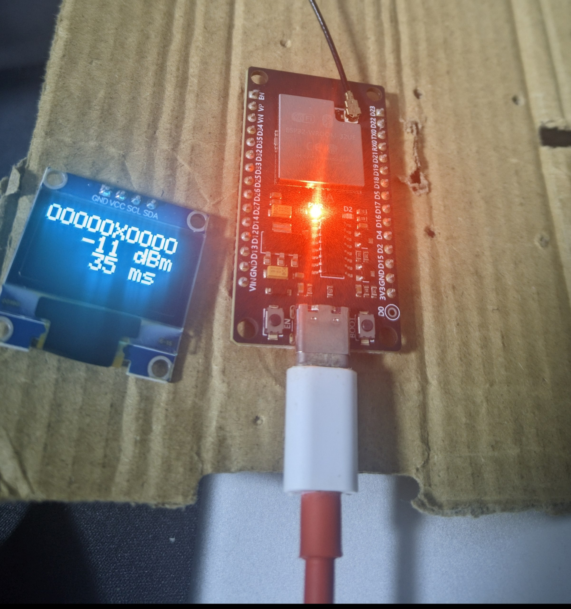

# maimai monitor

**NOW integrated with OLED 128x64 SSD13xx.**

By posting ping request to maimai wahlap server, we could check it's response time (with an existing TLS session) and whether it's responding.

In this project, you could be notified in two ways: the LED at pin 2, and an external OLED screen.

## Pictures

## Build

Before start, you must have `Adafruit SSD1306` installed.

- Connect the `OLED:VCC` with a 5V or 3.3V power supplyment (according to the vendor)
- Connect `OLED:GND` with `ESP:GND` if you used `3.3V`/`VIN` on the board, or `*:GND` for an external power.
- Connect `ESP:D22` with `OLED:SDA`, and connect `ESP:D23` with `OLED:SDL`.

Now edit the Wifi SSID and password, compile and upload.
